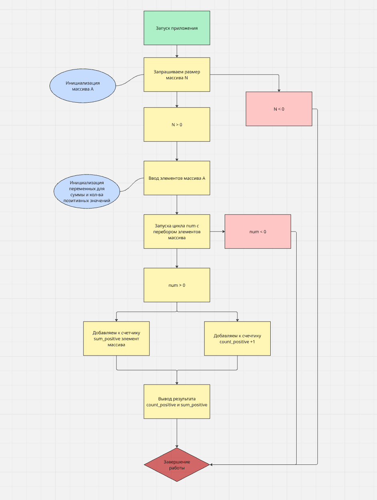

Кейс-задача № 1 Разработать блок-схему алгоритма, написать код программы на языке высокого уровня, составить тестовые примеры исходных данных, которые охватывали бы прохождение всех ветвей алгоритма, составить описание объектных моделей кода. Дан одномерный массив А размерности N. Найти сумму положительных элементов и их количество.

Блок схема

