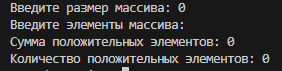
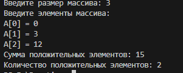
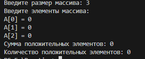
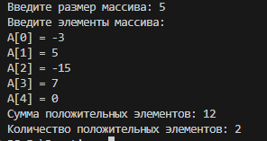

Кейс-задача № 1 Разработать блок-схему алгоритма, написать код программы на языке высокого уровня, составить тестовые примеры исходных данных, которые охватывали бы прохождение всех ветвей алгоритма, составить описание объектных моделей кода. Дан одномерный массив А размерности N. Найти сумму положительных элементов и их количество.

<h2 align="center"><b>Блок схема</b></h2>

## Тестовые примеры

### 1. Пустой массив

**Входные данные:** `N = 0, A = []`  
**Ожидаемый результат:** `Сумма = 0, Количество = 0`  

### 2. С положительными и нулями

**Входные данные:** `N = 3, A = [0, 3, 12]`  
**Ожидаемый результат:** `Сумма = 15, Количество = 2` (0 не учитывается)  

### 3. Только нули

**Входные данные:** `N = 3, A = [0, 0, 0]`  
**Ожидаемый результат:** `Сумма = 0, Количество = 0`  

### 4. Смешанные значения

**Входные данные:** `N = 5, A = [-3, 5, -15, 7, 0]`  
**Ожидаемый результат:** `Сумма = 12, Количество = 2` (отрицательные и 0 не учитываются)  

