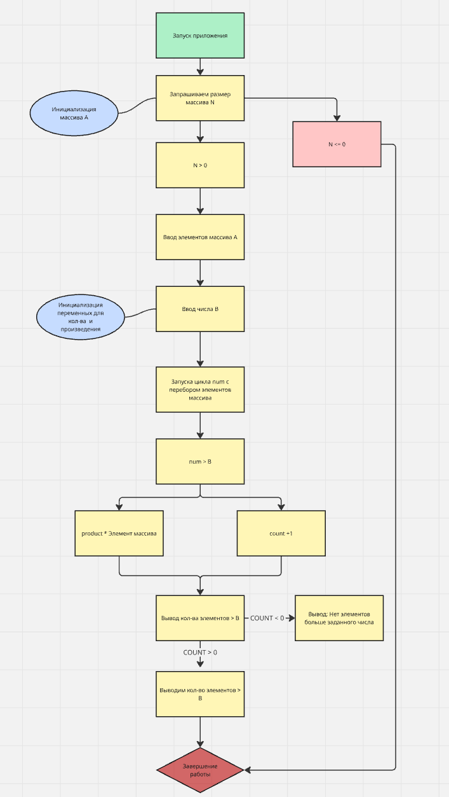
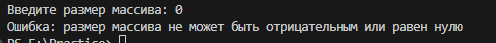
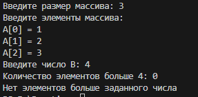
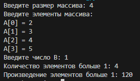
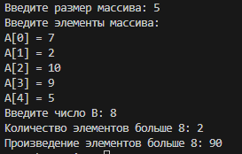
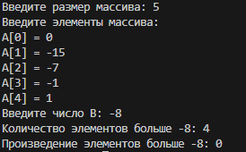

Кейс-задача № 2 Разработать блок-схему алгоритма, написать код программы на языке высокого уровня, составить тестовые примеры исходных данных, которые охватывали бы прохождение всех ветвей алгоритма, составить описание объектных моделей кода. Дан одномерный массив А размерности N. Найти количество элементов, больших заданного числа В и их произведение.

<h2 align="center"><b>Блок схема</b></h2>

## Тестовые примеры

### 1. Пустой массив

**Входные данные:** `N = 0, A = []`  
**Ожидаемый результат:** `Ошибка: размер массива не может быть отрицательным или равен нулю`

### 2. Нет элементов > B

**Входные данные:** `N = 3, A = [1, 2, 3], B = 4`  
**Ожидаемый результат:** `>B = 0, Нет элементов > B`

### 3. Все элементы > B

**Входные данные:** `N = 4, A = [2, 3, 4, 5], B = 1`  
**Ожидаемый результат:** `>B = 4, Произведение = 120`

### 4. некоторые эелменты > B

**Входные данные:** `N = 5, A = [7, 2, 10, 9, 5], B = 8`  
**Ожидаемый результат:** `>B = 2, Произведение = 90`

### 5. Некоторые элементы отрицательные, B также отрицательное

**Входные данные:** `N = 5, A = [0, -15, -7, -1, 1], B = -8`  
**Ожидаемый результат:** `>B = 2, Произведение = 0`

